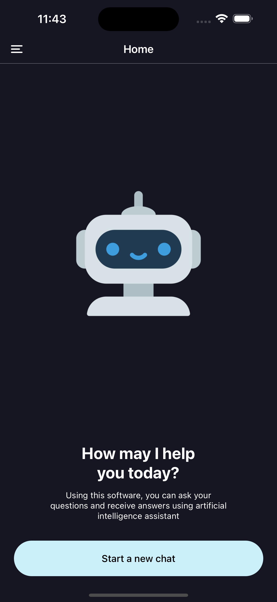
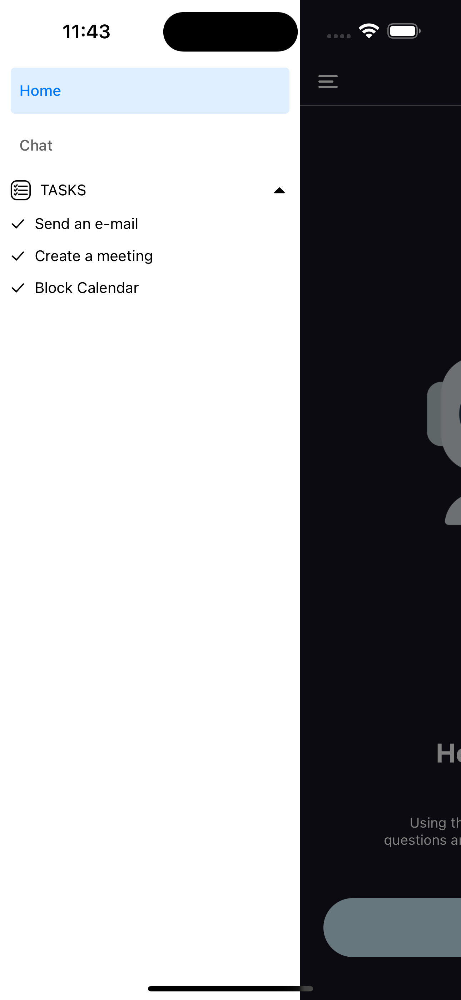
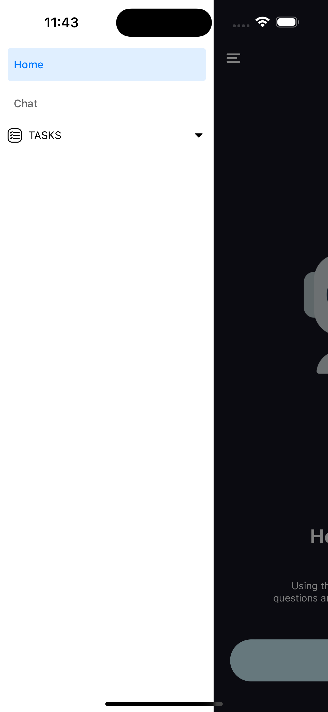
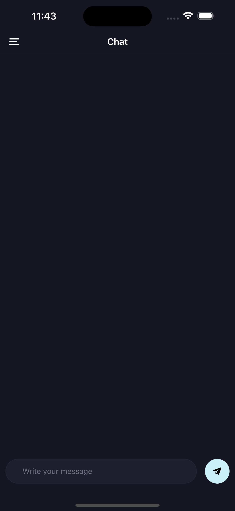
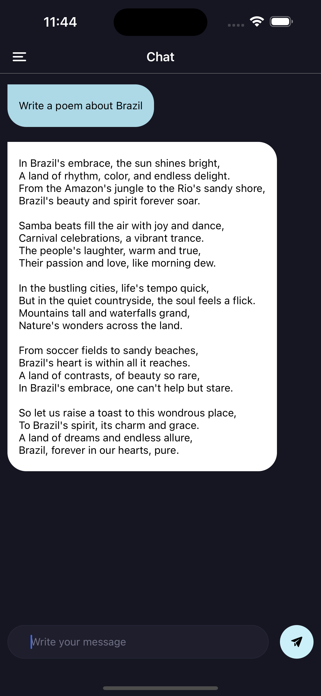

## Configuration

This project was bootstrapped with [Expo](https://expo.dev/).

In the project directory, you can run:

1. `npm install`
2. `update EXPO_PUBLIC_OPENAI_KEY inside .env file using a valid openai token`
3. `npm run ios`
4. then follow the prompts on screen to test the simulators.

### Screenshots

Home Screen

Menu Expanded

Menu Collapsed

Chat Screen

Chat Prompt Screen

## Test Notes:

### Test requirements

- The chat-UI should have text streaming support ✅
- The chat-UI should expand / collapse the list of tasks under the heading of “tasks” in the task pane; ✅
- Adjust to different screen sizes and adapt well for mobile layout ✅
- Streaming using SSE (Server-Sent Events) with chatGPT turbo ✅

### State management
No state management tool was required aside from component state to keep all the state manageable.

### Style
I'd rather use styled components for the style. However, this is a prototype and time was a restriction right now.

### Typescript
typescript was used to help the type safety across the project even so, a few places still missing types.

### Errors
I'd classify errors by type eg. User errors and Application. Then severety to provide a better experience to the user.

### Performance
I did not see any opportunity for performance improvements to justify the usage of React.memo and useMemo for instance.

### Improvements
- Add unit tests
- Remove inline css
- Add a linter

### Challenges
Learn how Chat-GPT SSE works then implement in react native was critical during the technical decisions made 
while developing.